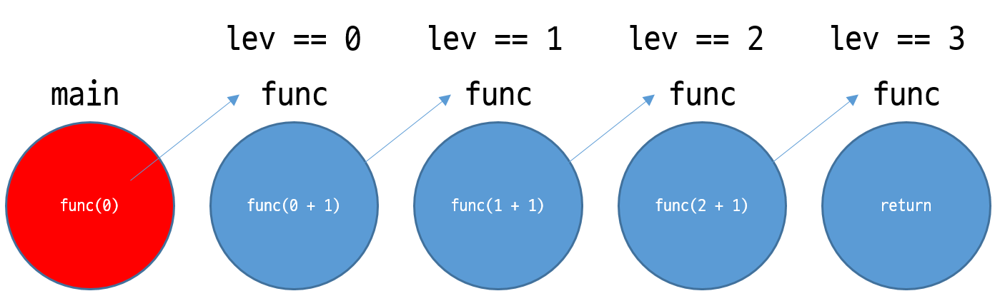
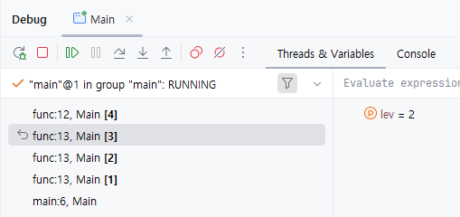

# Recursion - Java

# 기본 개념

함수 안에서 동일한 함수를 또 호출하는게 recursion, 한국어로 재귀다.

재귀는 대체 언제 쓰는가? 모든 경우를 시도해봐야 할 경우에 사용.

백트래킹, DFS 의 기본이 된다.

```java
import java.io.*;
import java.util.*;

public class Main {
    public static void main(String args[]) throws Exception {
        func();
    }

    static void func() {
        func();
    }
}
```

가장 단순한 재귀함수의 형태다.

저러면 대체 언제 끝나지? ⇒ 안 끝남. 끝나는 조건이 없기 때문.

재귀는 종료조건이 없으면 위처럼 무한히 반복된다. 따라서, 재귀를 사용할 때는 반드시 종료조건을 포함시켜야 한다.

기본 형태

```java
import java.io.*;
import java.util.*;

public class Main {
    public static void main(String args[]) throws Exception {
        func(0);
    }

    static void func(int lev) {
        // 종료조건
        if (lev == 3)
            return;
        func(lev + 1);
    }
}
```

도식화하면 다음과 같다.



0레벨부터 시작한다.

함수의 종료는? 리턴이다. `lev == 3` 이 재귀의 종료조건.

그럼 그 전까지 있던 다른 함수는 어떻게 종료될까? 종료라는것은 특별한 게 아니다. 함수가 끝나면 종료되는 것이다.

```java
    func(lev + 1);
}
```

위 구문에서, `func(lev + 1)` 이 리턴되어 끝났다면, 더 실행할 것이 없기 때문에 순차적으로, 다른 함수들도 모두 종료되는 것.

그럼 간단한 질문.

실행된 `func` 함수는 총 몇 개인가?

4개다. 

그러면 `lev` "변수" 는 총 몇 개인가?

마찬가지로 4개다. 왜냐, `lev` 은 매개변수로 넘겨준다.

따라서, 각각의 재귀함수가 모두 `lev` 을 별도로 보유하고 있다.

- 위 코드에서 `func(lev++)` 을 해버리면 안된다! 그러면 받는 함수에선 늘어난 값이 맞지만, 주는 함수에선 증가되어버리기 때문. 각 함수의 `lev` 은 유지되어야 한다.

이제, `return` 에 중단점을 하나 걸고, 디버깅을 실행해보자. 왼쪽을 자세히 보면



재귀함수가 몇 번 실행되었는지 알 수 있고, 각각의 호출 스택을 더블클릭할 시, 조사식에서 현재 `lev` 값이 무엇인지 알 수 있다.

즉, 각각의 재귀함수는 모두 `lev` 을 별도로 보유하고 있다.

문제: 각 재귀함수의 레벨을 출력하시오.

종료조건: `lev == 7`

```java
import java.io.*;
import java.util.*;

public class Main {
    public static void main(String args[]) throws Exception {
        func(0);
    }

    static void func(int lev) {
        System.out.print(lev + " ");
        // 종료조건
        if (lev == 7)
            return;
        func(lev + 1);
    }
}
```

```
0 1 2 3 4 5 6 7
```

그럼, 아래와 같이 하면 어떨까?

```java
import java.io.*;
import java.util.*;

public class Main {
    public static void main(String args[]) throws Exception {
        func(0);
    }

    static void func(int lev) {
        // 종료조건
        if (lev == 7)
            return;
        func(lev + 1);
        System.out.print(lev + " ");
    }
}
```

```
6 5 4 3 2 1 0
```

엥? 거꾸로 찍혔다. 게다가, 7 은 찍히지 않았다.

호출 스택을 보면, 분명히 각각의 `lev` 은 변함이 없다.

그런데 출력 부분을 자세히 보면, 재귀함수의 호출 이후에 출력.

즉, 위 코드는 현재 호출 스택에서, 보유하고 있는 `lev` 값을 찍어낸다고 할 수 있다.

리턴이 재귀 종료의 기준이기 때문에, 맨 끝은 이미 7 이 된 상태고, 재귀를 탈출했을 땐 6 이므로,

탈출하고 찍고, 탈출하고 찍고를 반복하면

6 5 4 3 2 1 0

이건 어떨까?

```java
import java.io.*;
import java.util.*;

public class Main {
    public static void main(String args[]) throws Exception {
        func(0);
    }

    static void func(int lev) {
        // 종료조건
        if (lev == 7)
            return;
        System.out.print(lev + " ");
        func(lev + 1);
    }
}
```

```
0 1 2 3 4 5 6
```

위 경우, 종료조건 이후에 출력되기 때문에, 6 까지만 출력됨.

위 연습은 별 것 아닌것같아 보이지만, 내가 원하는 로직을 어디에 배치해야하는지 알기 위함이다.

만약 `cnt` 를 활용한 문제라면, 세 부분 중 아무 곳에나 `cnt` 를 증가시키는 로직을 넣을 수는 없다.

즉, 내가 원하는 부분을 정확히 알고, 구현하기 위한 훈련이다.

문제. 배열 출력

사이즈가 6인 배열을 선언하고, 정수 여섯개를 입력받는다.

한번 전체 출력 한 후, 거꾸로 다시 출력하되, 재귀를 사용하라.

ex1) 1 2 3 4 5 6 ⇒ 1 2 3 4 5 6 5 4 3 2 1

ex2) 3 5 4 6 2 9 ⇒ 3 5 4 6 2 9 2 6 4 5 3

```java
import java.io.*;
import java.util.*;

public class Main {
    static int arr[] = new int[6];

    public static void main(String args[]) throws Exception {
        System.setIn(new FileInputStream("src/sample_input.txt"));
        Scanner sc = new Scanner(System.in);

        for (int i = 0; i < arr.length; i++) {
            arr[i] = sc.nextInt();
        }

        func(0);
    }

    static void func(int lev) {
        System.out.print(arr[lev] + " ");
        if (lev == 5)
            return;
        func(lev + 1);
        System.out.print(arr[lev] + " ");
    }
}
```

---

문제.

숫자 n을 입력 받으세요.

숫자 n부터 0까지 Count down 했다가

다시 돌아오는 수를 출력 하시면 됩니다.

ex) 4

4 3 2 1 0 1 2 3 4

ex ) 6

6 5 4 3 2 1 0 1 2 3 4 5 6

- 종료조건을 잘 생각해볼 것

---

매개변수로 `lev` 뿐만 아니라, 다른 변수도 물론 가능하다. `n` 을 추가로 넣겠다.

종료조건: `n == 0`

```java
import java.io.*;
import java.util.*;

public class Main {
    static int n;

    public static void main(String args[]) throws Exception {
        System.setIn(new FileInputStream("src/sample_input.txt"));
        Scanner sc = new Scanner(System.in);

        n = sc.nextInt();

        func(0, n);
    }

    static void func(int lev, int n) {
        if (n == 0) {
            System.out.print(n + " ");
            return;
        }
        System.out.print(n + " ");
        func(lev + 1, n - 1);
        System.out.print(n + " ");
    }
}
```

- 추가한 `n` 역시 각 함수마다 별도로 보유한다.
- 정작 사용하지도 않은 `lev` 은 디버깅할 때 사용할수도 있을 것이다. 몇 번째 재귀 호출인지 알고싶다면 `n` 으로는 정보가 부족하다.

이번엔 다음 코드를 보자.

```java
import java.io.*;
import java.util.*;

public class Main {
    public static void main(String args[]) throws Exception {
        func(0);
    }

    static void func(int lev) {
        if (lev == 2)
            return;
        func(lev + 1);
        func(lev + 1);
    }
}
```

그러니깐, 재귀가 두 번 들어갔다. 대체 무슨 일이 일어나는걸까?

도식화해보면 다음과 같다.


트리 구조로 만들어진다.

용어 정리를 해보면,

lev : 얼마나 깊은지 여부

brench : 몇 개로 갈리는지 여부 (가지)

위 코드는 for loop 로 다음과 같이 변경 가능하다.

```java
import java.io.*;
import java.util.*;

public class Main {
    public static void main(String args[]) throws Exception {
        func(0);
    }

    static void func(int lev) {
        if (lev == 2)
            return;
        for (int i = 0; i < 2; i++) {
            func(lev + 1);
        }
    }
}
```

이 코드만 보고, 그래프를 그릴 줄 알아야 한다.

레벨은 종료 조건을 보고 즉시 판단 가능하다.

그럼 brench 의 갯수는? 두 개다. 두 번 반복하기 때문이다.

다음 문제를 풀기 전, 위 그래프를 종이에 그린다.

그리고, 실행이 이루어지는 순서대로 펜을 따라가보자.

---

문제: 다음 코드를 보고, 어떤 형태의 트리가 그려지는지를 맞춰라.

```java
import java.io.*;
import java.util.*;

public class Main {
    public static void main(String args[]) throws Exception {
        func(0);
    }

    static void func(int lev) {
        if (lev == 5)
            return;
        for (int i = 0; i < 3; i++) {
            func(lev + 1);
        }
    }
}
```

lev: 5

brench: 3


# 과제

민코딩 사이트에서 다음을 풀어오자.

훈련반1 - Lev20 (재귀호출 1 : 무한 호출 막기)